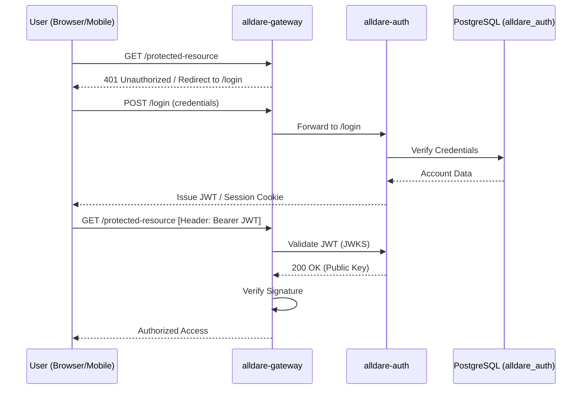

# alldare-auth

Identity and Authorization Provider for Alldare. Implements OAuth2/OIDC using Spring Authorization Server.

## Authentication Flow

## Core Entities
*   **Account:** Central credential and status management.
*   **User:** User-specific profile link.
*   **Admin:** Administrator-specific profile link.
